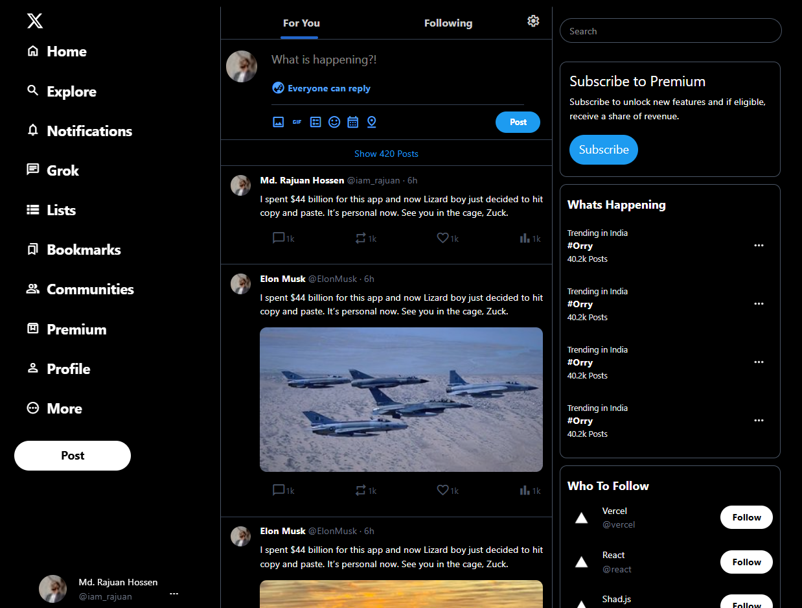

# X.com Home Page Clone

A clone of the X.com home page UI built using modern web technologies including React and Tailwind CSS v4.

## Screenshot



## Features

* Accurate UI replication of the X.com home page
* Responsive design
* Optimized for desktop and mobile views

## Technologies Used

* React
* Tailwind CSS v4
* Framer Motion (for animations)

## Getting Started

1. **Clone the repository:**

   ```bash
   git clone https://github.com/iam-rajuan/twitter-x-clone.git
   ```

2. **Install dependencies:**

   ```bash
   cd twitter-x-clone
   npm install
   ```

3. **Run the application:**

   ```bash
   npm run build
   ```

## Contributing

Contributions are welcome! Please open an issue or submit a pull request.

## License

This project is licensed under the MIT License.
